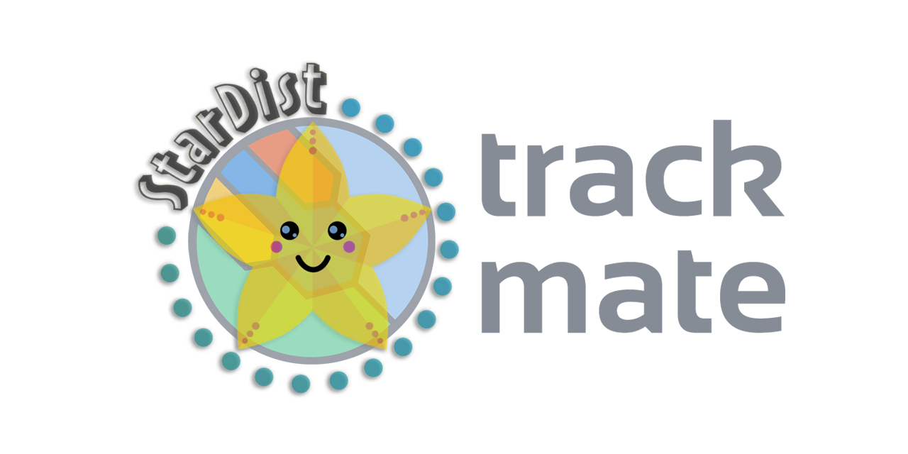

# TrackMate-StarDist

A TrackMate detector that uses StarDist to segment object.

## Installation and documentation. 

The installation procedure, documentation and tutorials can be found on the ImageJ wiki:
[TrackMate-StarDist page](https://imagej.net/plugins/trackmate/trackmate-stardist)
